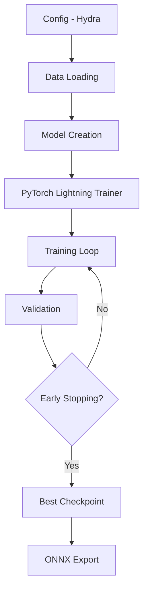
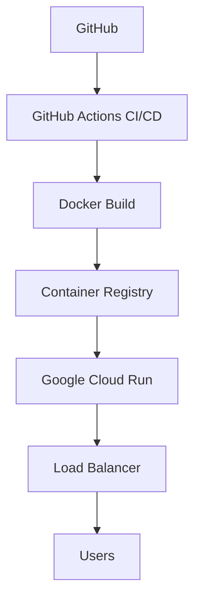

# System Architecture

Overview of the MLOps Skin Lesion Classification Pipeline architecture.

## High-Level Architecture


## Model Architecture

We implement a three-tier model architecture:

### 1. BaselineCNN
Simple CNN with convolutional blocks for baseline performance.

### 2. ResNet
Residual network with skip connections for better gradient flow.

### 3. EfficientNet
State-of-the-art transfer learning with ImageNet pretrained weights.

## Data Pipeline


## Training Pipeline



## Inference Pipeline


## Deployment Architecture



## Technology Components

| Component | Technology | Purpose |
|-----------|-----------|---------|
| ML Framework | PyTorch Lightning | Training orchestration |
| Configuration | Hydra | Experiment configs |
| Data Versioning | DVC | Dataset management |
| Experiment Tracking | Weights & Biases | Metrics logging |
| API Server | FastAPI | Inference endpoint |
| Model Runtime | ONNX Runtime | Fast inference |
| Containerization | Docker | Reproducible deployment |
| Cloud Platform | Google Cloud Run | Serverless hosting |
| CI/CD | GitHub Actions | Automated testing |

## Directory Structure

```
dtu-vibe-ops-02476/
├── src/mlops_project/     # Source code
│   ├── model.py           # Model architectures
│   ├── data.py            # Dataset handling
│   ├── train.py           # Training script
│   ├── evaluate.py        # Evaluation
│   └── api.py             # FastAPI server
├── configs/               # Hydra configurations
├── data/                  # Dataset (DVC managed)
├── models/                # Trained models
├── tests/                 # Test suite
├── dockerfiles/           # Container definitions
└── docs/                  # Documentation
```
