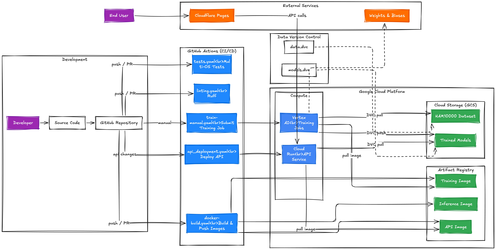
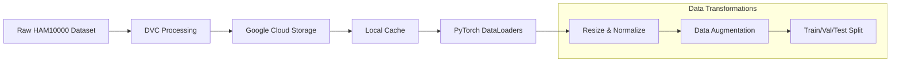
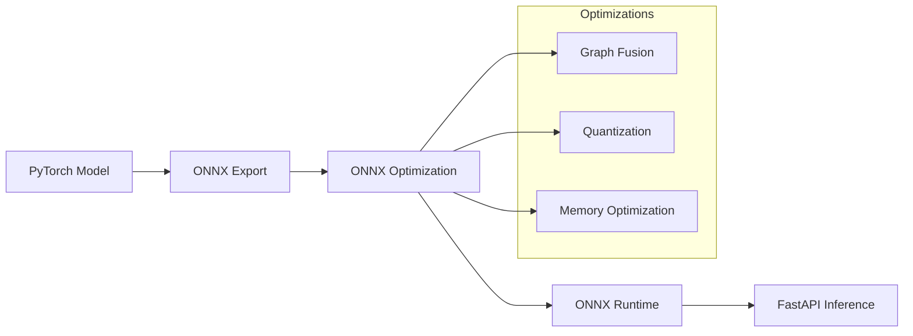
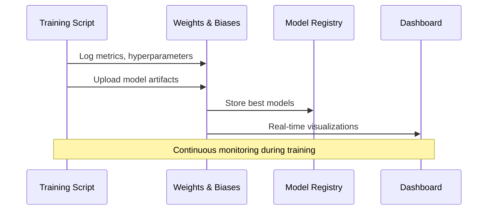
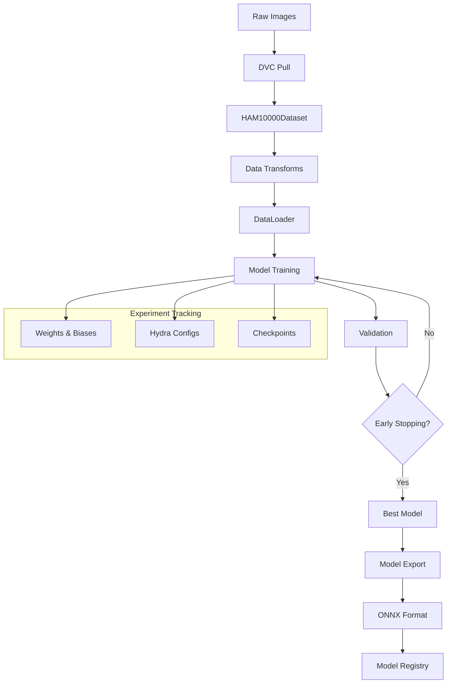
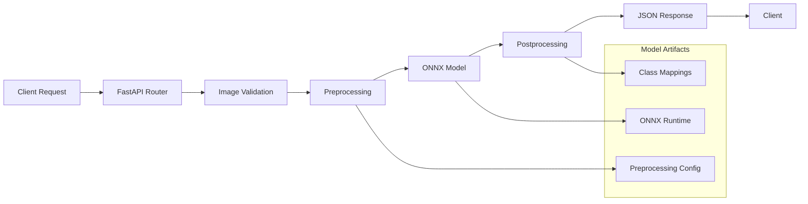

# System Architecture

This page provides a comprehensive overview of the MLOps Skin Lesion Classification Pipeline architecture, designed for scalability, maintainability, and production readiness.

## High-Level Architecture



*Complete MLOps pipeline architecture showing data flow, training, and deployment components*

## Core Components Overview

Our system implements a modern MLOps pipeline with clear separation of concerns and industry-standard practices:

<div class="grid">
  <div class="card">
    <h3>📊 Data Pipeline</h3>
    <p>DVC-managed datasets with preprocessing, augmentation, and validation splits</p>
  </div>
  
  <div class="card">
    <h3>🧠 Model Training</h3>
    <p>PyTorch Lightning orchestration with Hydra configuration management</p>
  </div>
  
  <div class="card">
    <h3>🔄 Experiment Tracking</h3>
    <p>Weights & Biases integration for metrics, hyperparameters, and artifacts</p>
  </div>
  
  <div class="card">
    <h3>🚀 Model Serving</h3>
    <p>FastAPI inference server with ONNX runtime optimization</p>
  </div>
  
  <div class="card">
    <h3>☁️ Cloud Infrastructure</h3>
    <p>Google Cloud deployment with container orchestration</p>
  </div>
  
  <div class="card">
    <h3>🧪 Testing & CI/CD</h3>
    <p>Automated testing, quality gates, and deployment pipelines</p>
  </div>
</div>

## Detailed Component Architecture

### 1. Data Management Layer

#### Data Version Control (DVC)


**Key Features:**
- **Reproducible data splits** with deterministic seeding
- **Automatic caching** for faster iteration
- **Cloud storage integration** for team collaboration
- **Data validation** with automated quality checks

#### Dataset Structure
```
data/
├── ham10000/
│   ├── HAM10000_images/           # Raw dermatoscopic images (10,015 images)
│   ├── HAM10000_metadata.csv     # Labels and clinical metadata
│   └── processed/                # Preprocessed and split datasets
│       ├── train/               # Training set (70%)
│       ├── val/                 # Validation set (15%)  
│       └── test/               # Test set (15%)
```

### 2. Model Architecture Tier System

Our three-tier approach provides flexibility for different computational requirements:

#### Tier 1: Baseline CNN (`src/mlops_project/model.py:48`)
```python
class BaselineCNN(pl.LightningModule):
    """Simple CNN architecture for baseline performance"""
    
    def __init__(self, num_classes=2, dropout_rate=0.5):
        super().__init__()
        self.features = nn.Sequential(
            # Conv Block 1: 3→32 channels
            ConvBlock(3, 32),
            # Conv Block 2: 32→64 channels  
            ConvBlock(32, 64),
            # Conv Block 3: 64→128 channels
            ConvBlock(64, 128),
            # Conv Block 4: 128→256 channels
            ConvBlock(128, 256)
        )
        self.classifier = nn.Sequential(
            nn.AdaptiveAvgPool2d((1, 1)),
            nn.Flatten(),
            nn.Dropout(dropout_rate),
            nn.Linear(256, 128),
            nn.ReLU(),
            nn.Dropout(dropout_rate),
            nn.Linear(128, num_classes)
        )
```

**Characteristics:**
- **Parameters**: ~1.5M parameters
- **Training time**: ~10 minutes on CPU
- **Use case**: Quick prototyping, resource-constrained environments

#### Tier 2: Residual CNN (`src/mlops_project/model.py:123`)
```python
class ResNet(pl.LightningModule):
    """Residual CNN with skip connections for improved gradient flow"""
    
    def __init__(self, num_classes=2, num_layers=18):
        super().__init__()
        # Residual blocks with skip connections
        self.conv1 = nn.Conv2d(3, 64, kernel_size=7, stride=2, padding=3)
        self.bn1 = nn.BatchNorm2d(64)
        self.relu = nn.ReLU(inplace=True)
        self.maxpool = nn.MaxPool2d(kernel_size=3, stride=2, padding=1)
        
        # Residual layers
        self.layer1 = self._make_layer(BasicBlock, 64, 64, 2)
        self.layer2 = self._make_layer(BasicBlock, 64, 128, 2, stride=2)
        self.layer3 = self._make_layer(BasicBlock, 128, 256, 2, stride=2)
        self.layer4 = self._make_layer(BasicBlock, 256, 512, 2, stride=2)
```

**Characteristics:**
- **Parameters**: ~11M parameters
- **Training time**: ~30 minutes on GPU
- **Use case**: Balanced performance and efficiency

#### Tier 3: EfficientNet Transfer Learning (`src/mlops_project/model.py:198`)
```python
class EfficientNet(pl.LightningModule):
    """Transfer learning with pretrained EfficientNet backbone"""
    
    def __init__(self, variant="b0", num_classes=2, pretrained=True):
        super().__init__()
        # Load pretrained EfficientNet
        self.backbone = getattr(models, f"efficientnet_{variant}")(
            weights=EFFICIENTNET_WEIGHTS[variant] if pretrained else None
        )
        
        # Replace classifier head
        num_features = self.backbone.classifier[1].in_features
        self.backbone.classifier = nn.Sequential(
            nn.Dropout(0.3),
            nn.Linear(num_features, num_classes)
        )
```

**Characteristics:**
- **Parameters**: 5M-66M (variant dependent)
- **Training time**: ~1-2 hours on GPU
- **Use case**: Production deployment, highest accuracy

### 3. Training Orchestration

#### PyTorch Lightning Integration
```python
# Training configuration with Lightning
trainer = pl.Trainer(
    accelerator="auto",                    # Automatic device selection
    devices="auto",                        # Multi-GPU support
    max_epochs=config.training.max_epochs,
    callbacks=[
        ModelCheckpoint(
            dirpath=f"models/{config.model.name}/",
            filename="{epoch:03d}-{val_loss:.3f}",
            monitor="val_loss",
            save_top_k=3
        ),
        EarlyStopping(
            monitor="val_loss",
            patience=config.training.early_stopping_patience,
            mode="min"
        ),
        LearningRateMonitor(logging_interval="epoch")
    ],
    logger=WandbLogger() if config.wandb.enabled else None
)
```

#### Hydra Configuration System
```yaml
# configs/config.yaml
defaults:
  - model: efficientnet
  - _self_

# Data configuration
data:
  batch_size: 32
  image_size: 224
  num_workers: 4
  subsample_percentage: 1.0
  
# Training configuration  
training:
  max_epochs: 25
  learning_rate: 0.0001
  weight_decay: 0.01
  early_stopping_patience: 7
```

### 4. Inference and Serving Architecture

#### FastAPI Server (`src/mlops_project/api.py:1`)

```python
from fastapi import FastAPI, File, UploadFile
import onnxruntime as ort
import numpy as np
from PIL import Image

app = FastAPI(
    title="Skin Lesion Classification API",
    description="MLOps pipeline for dermatoscopic image classification",
    version="1.0.0"
)

@app.post("/predict")
async def predict(file: UploadFile = File(...)):
    """
    Classify a dermatoscopic image as malignant or benign
    
    Args:
        file: Uploaded image file (JPEG/PNG)
        
    Returns:
        JSON response with prediction and confidence scores
    """
    # Image preprocessing
    image = Image.open(file.file).convert('RGB')
    image = preprocess_image(image)
    
    # ONNX inference
    outputs = ort_session.run(None, {'input': image})
    probabilities = softmax(outputs[0][0])
    
    return {
        "prediction": "malignant" if probabilities[1] > 0.5 else "benign",
        "confidence": float(max(probabilities)),
        "class_probabilities": {
            "benign": float(probabilities[0]),
            "malignant": float(probabilities[1])
        }
    }
```

#### ONNX Runtime Optimization



**Performance Benefits:**
- **3x faster inference** compared to PyTorch
- **50% memory reduction** through optimization
- **Cross-platform compatibility** (CPU/GPU)
- **Production-ready** with minimal dependencies

### 5. Cloud Infrastructure

#### Google Cloud Deployment

```yaml
# cloudbuild.train.yaml
steps:
  - name: 'gcr.io/cloud-builders/docker'
    args: ['build', '-t', 'gcr.io/$PROJECT_ID/mlops-training', '.']
    
  - name: 'gcr.io/cloud-builders/docker'  
    args: ['push', 'gcr.io/$PROJECT_ID/mlops-training']
    
  - name: 'gcr.io/google.com/cloudsdktool/cloud-sdk'
    entrypoint: 'gcloud'
    args: [
      'run', 'deploy', 'skin-lesion-api',
      '--image', 'gcr.io/$PROJECT_ID/mlops-training',
      '--platform', 'managed',
      '--region', 'europe-west1',
      '--allow-unauthenticated'
    ]
```

#### Container Architecture

```dockerfile
# Multi-stage Dockerfile for optimized deployment
FROM python:3.12-slim as builder
WORKDIR /app
COPY pyproject.toml uv.lock ./
RUN pip install uv && uv sync --frozen

FROM python:3.12-slim as runtime  
WORKDIR /app
COPY --from=builder /app/.venv /app/.venv
COPY src/ ./src/
COPY models/ ./models/

ENV PATH="/app/.venv/bin:$PATH"
EXPOSE 8000

CMD ["uvicorn", "src.mlops_project.api:app", "--host", "0.0.0.0", "--port", "8000"]
```

### 6. Monitoring and Observability

#### Experiment Tracking Flow



#### Key Metrics Tracked

| Category | Metrics | Purpose |
|----------|---------|---------|
| **Performance** | Accuracy, F1, Precision, Recall, AUC-ROC | Model quality assessment |
| **Training** | Loss curves, learning rate, epoch time | Optimization monitoring |  
| **System** | GPU utilization, memory usage, throughput | Resource optimization |
| **Data** | Batch size, augmentation effects | Data pipeline efficiency |

### 7. CI/CD Pipeline Architecture

#### GitHub Actions Workflow

```yaml
# .github/workflows/tests.yaml
name: Tests and Quality Checks

on: [push, pull_request]

jobs:
  test:
    runs-on: ${{ matrix.os }}
    strategy:
      matrix:
        os: [ubuntu-latest, windows-latest, macos-latest]
        python-version: ["3.12"]
        
    steps:
      - uses: actions/checkout@v4
      - name: Set up uv
        run: curl -LsSf https://astral.sh/uv/install.sh | sh
      - name: Install dependencies
        run: uv sync
      - name: Run tests
        run: uv run pytest tests/ --cov=src --cov-report=xml
      - name: Quality checks
        run: uv run ruff check src/ tests/
```

## Data Flow Architecture

### Training Pipeline Data Flow



### Inference Pipeline Data Flow



## Scalability and Performance Considerations

### Horizontal Scaling

- **Multi-GPU training** with PyTorch Lightning's DDP
- **Cloud Run auto-scaling** based on request volume
- **Load balancing** across multiple API instances
- **Distributed data loading** with multiple workers

### Performance Optimizations

1. **Model Optimization**:
   - ONNX graph optimization and quantization
   - Mixed precision training (FP16)
   - Gradient accumulation for larger effective batch sizes

2. **Data Pipeline**:
   - Prefetching and parallel data loading
   - In-memory caching for frequently accessed data
   - Lazy loading for large datasets

3. **Infrastructure**:
   - Container image optimization with multi-stage builds
   - CDN integration for static assets
   - Database connection pooling

### Security Architecture

- **Model artifacts** stored in private cloud storage
- **API authentication** with configurable tokens
- **Input validation** for uploaded images
- **Rate limiting** to prevent abuse
- **HTTPS encryption** for all communications

## Deployment Environments

### Development Environment
- **Local training** with subsampled data
- **CPU-based inference** for quick testing
- **SQLite** for local experiment tracking

### Staging Environment  
- **Cloud-based training** with full datasets
- **GPU acceleration** for realistic performance testing
- **Staging API deployment** for integration testing

### Production Environment
- **Auto-scaled inference** on Google Cloud Run
- **Multi-region deployment** for global availability
- **Comprehensive monitoring** and alerting
- **Blue-green deployments** for zero-downtime updates

---

This architecture provides a robust foundation for machine learning operations while maintaining flexibility for future enhancements and scaling requirements. The modular design ensures that individual components can be updated or replaced without affecting the entire system.

*Next: Explore the [User Guide](user-guide/training.md) to learn how to work with this architecture in practice.*